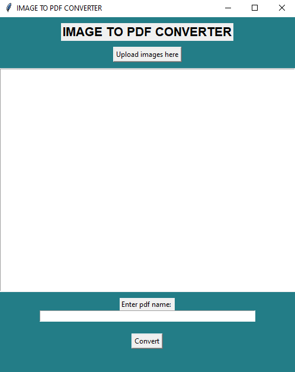

# Image to PDF Converter

The "Image to PDF Converter" is a simple desktop application developed in Python using the Tkinter GUI toolkit. It provides a user-friendly interface to convert multiple images into a single PDF file. The application allows users to select images, specify the output PDF name, and easily convert the images into a PDF document.

## GUI Interface



## Key Features

- **Image Selection:** Users can select multiple images from their file system using the "Upload images here" button.

- **PDF Name Entry:** Enter a custom name for the output PDF file in the "Enter pdf name" entry field.

- **Conversion:** Click the "Convert" button to convert the selected images into a PDF file.

## Getting Started

### Prerequisites

- Python installed
- Required Python libraries: tkinter, reportlab, Pillow (PIL)

### How to Use

1. Clone the repository:

   ```bash
   git clone https://github.com/yourusername/Image-to-PDF-Converter.git
   ```

2. Navigate to the project directory:

   ```bash
   cd Image-to-PDF-Converter
   ```

3. Install the required libraries:

   ```bash
   pip install -r requirements.txt
   ```

4. Run the application:

   ```bash
   python converter_app.py
   ```

5. The application window will appear, allowing you to upload images, specify the output PDF name, and convert the images.

## Author

Sutar_here (NIKHIL SUTAR)
GitHub: [Your GitHub Profile](https://github.com/carpentrycoder)

## License

This project is licensed under the MIT License - see the [LICENSE](LICENSE) file for details.

## Project Information

- **Project:** Image to PDF Converter
- **Technologies:** Python, Tkinter, reportlab, Pillow
- **Implementation Steps:** GUI design, image processing, PDF generation
- **Support Plan:** Basic support provided
- **Contribution Guidelines:** Feel free to submit issues or pull requests

## Acknowledgments

Special thanks to the contributors and the open-source community for their support.

**Note: This project is licensed under the [MIT License](LICENSE).**
